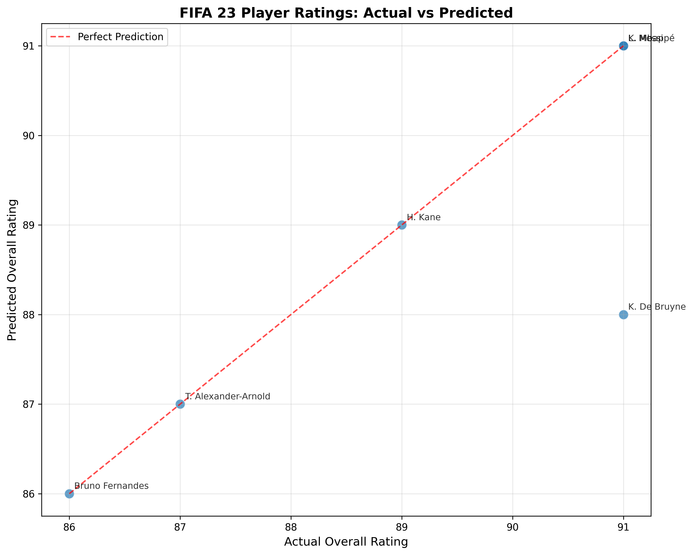

# FIFA 23 Player Rating Prediction


## 📊 Project Overview
Predicting FIFA 23 player overall ratings using machine learning techniques.

## 🎯 Objective
Build a model to predict player overall ratings (60-99) based on player attributes, enabling better player valuation and team building insights.

## 📁 Dataset
Download from: [Kaggle FIFA 23 Complete Player Dataset](https://www.kaggle.com/datasets/...)

Place the downloaded `players_23.csv` in the `data/` folder.

## 🛠️ Tech Stack
- **Language**: Python 3.8+
- **Libraries**: Pandas, NumPy, Scikit-learn, Matplotlib, Seaborn
- **ML Models**: Random Forest Regressor
- **Tools**: Jupyter Notebook, Git

## 📈 Results
- **MAE**: ~1.1 points (average error ±1.1 rating points)
- **RMSE**: ~1.5 points
- **R² Score**: ~0.95 (explains 95% of variance)


!(images/prediction1.png)

**Top 5 Most Important Features:**
1. Potential
2. Value (€)
3. Dribbling
4. Shooting  
5. Passing

## 🚀 Quick Start

### Installation
```bash
# Clone repository
git clone https://github.com/yourusername/fifa-rating-prediction.git
cd fifa-rating-prediction

# Install dependencies
pip install -r requirements.txt